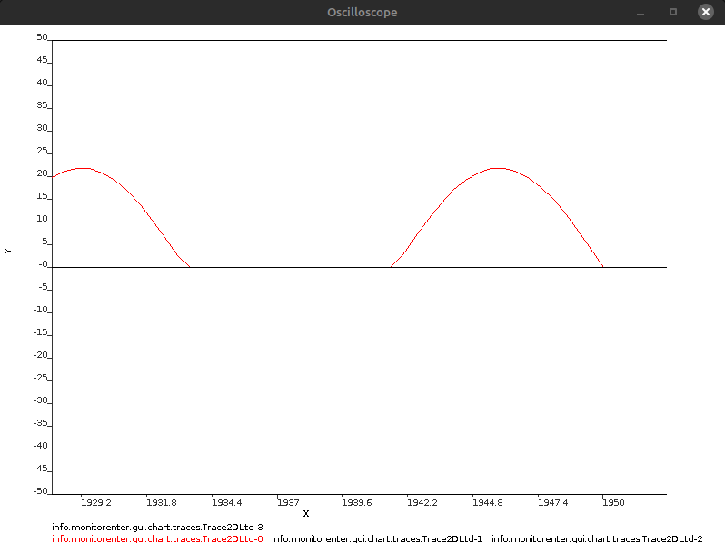
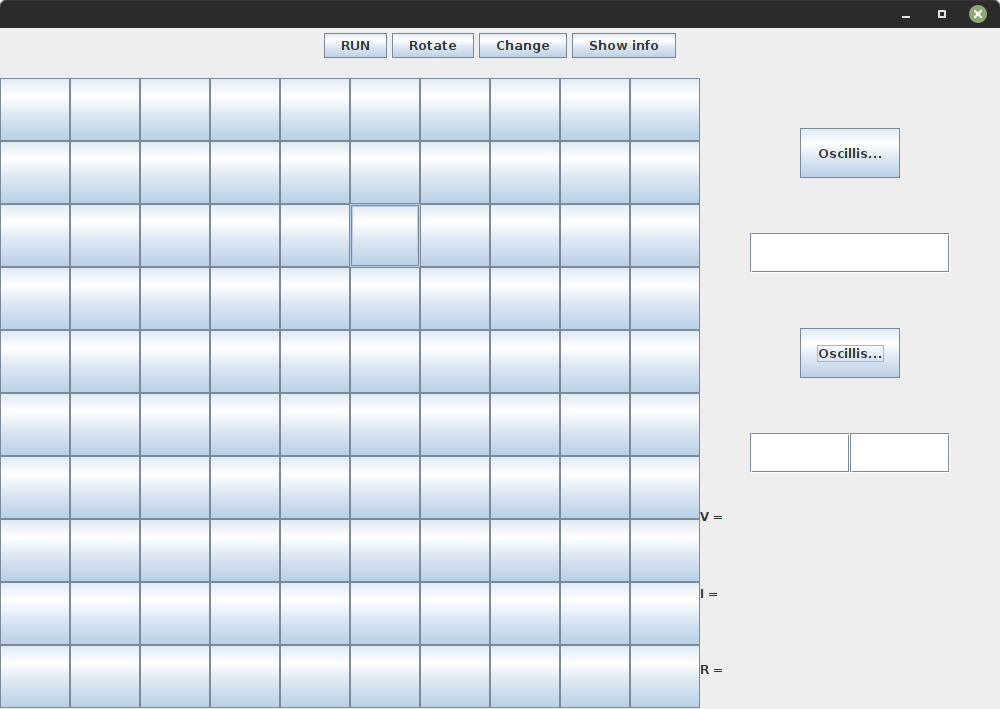
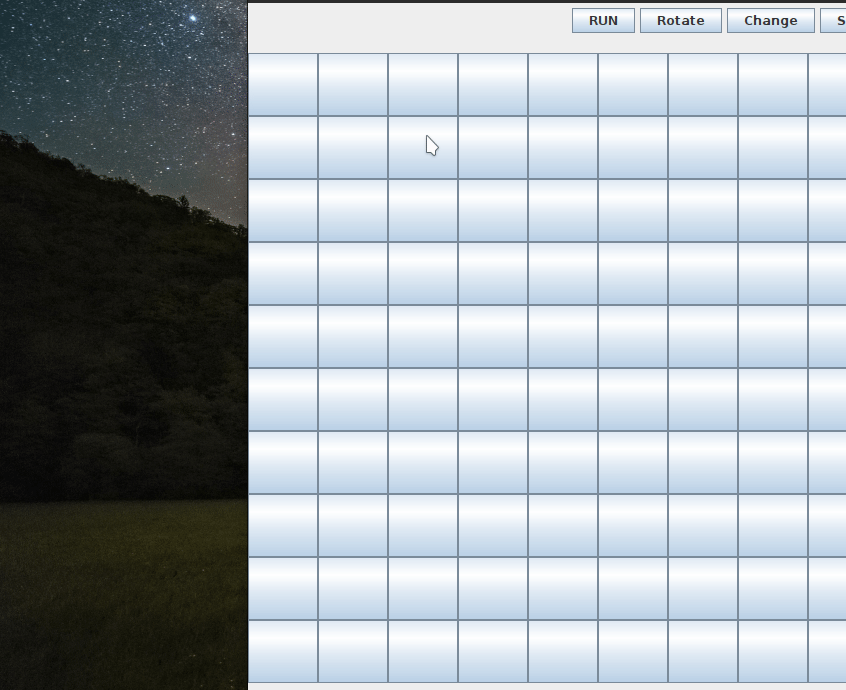
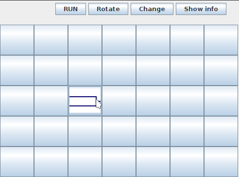
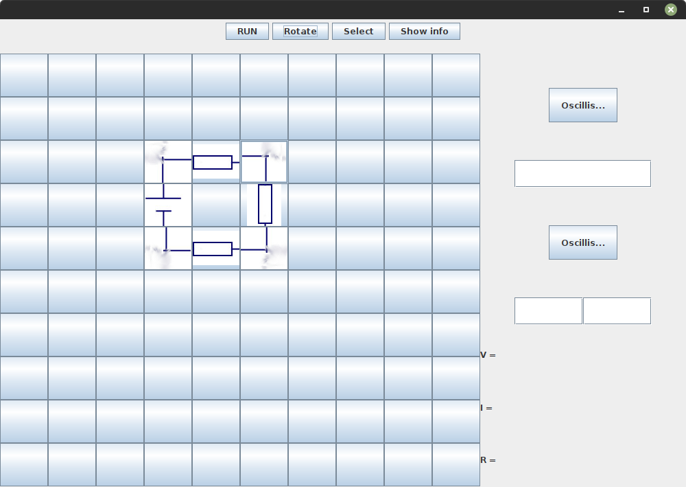

## Overview
Circuit Simulator is a circuit simulation program. It's written in Java, hence it's available on Windows Mac & Linux. It provides both CLI and GUI frontends. It supports multiple components, including non-linear and frequency-varrying components.
## Installation
You can find zip binary package in github [releases](https://github.com/hamza-Algohary/Circuit-Simulator/releases).
## Build From Source
First clone the github repository,
```
git clone https://github.com/hamza-Algohary/Circuit-Simulator
```
Then use makefile,
```
cd Circuit-Simulator
make
```
## Dependencies
Circuit Simulator uses the following libraries:
- [ejml](https://github.com/lessthanoptimal/ejml) (For solving linear system of equations)
- [jchart2d](https://jchart2d.sourceforge.net/) (For providing the oscilliscope)
- GUI is done using Swing&trade;

There is no need to install them before building from source, because they're already included in the repository.

## Usage
Circuit Simulator currently provides only CLI frontend. The GUI is mostly ready and is going to be available on next release.
Circuit Simulator takes a circuit from the user as a file, and prints out the solution to a file. 
Example Input File (test.txt) :
```
dcv 0,0 1,0 30
r 0,0 0,1 5
r 0,1 1,1 5
r 1,0 1,1 5
```
Which corresponds to the following circuit:


To run the program with that file, navigate to bin directory then fire up a terminal and type:

```
./run.sh test.txt
```

if you're running it for the first time you need to type this command first:

```
chmod +x run.sh
```

After running the program you will find a newly created file called `results.txt` containing key-value pairs of all variables in the circuit.

The output file of the above program will be:
```
I1.0,0.0:1.0,1.0 = 2.0
I0.0,0.0:1.0,0.0 = 2.0
V1.0,1.0 = -0.0
V0.0,0.0 = -20.0
I0.0,1.0:1.0,1.0 = -2.0
V0.0,1.0 = -10.0
V1.0,0.0 = 10.0
I0.0,0.0:0.0,1.0 = -2.0
```

## Input File Structure
The general structure for each line in the input file is the following

```<Component Name> <Start Coordinate> <End Coordinate> <Arguments> <Monitored variable (Optional)>```

Available names:
- r (Resistance)
- dcv (DC Voltage Source)
- dci (DC Current Source)
- w (Wire)
- acv (AC Voltage Source)
- aci (AC Current Source)
- c (Capacitor)
- d (Diode)

Inorder to decide coordinates, draw the desired circuit as shown above then give each node a coordinate. To make the process easiear align all components to be either horizontal or vertical, otherwise the program may produce unexpected results.

All components don't care which terminal is their start and which is their end, except three components (dcv , dci & d). For dcv and dci, the negative terminal is at start and positive terminal is at end. For the PN-junction diode P is at start, and N is at end.

Here is a list of expected arguments for each component:
- r (resistance)
- dcv (Voltage, where negative voltage reverses polarity)
- dci (Current, where negative current reverses polarity)
- w
- acv (Frequency) (Amplitude)
- aci (Frequency) (Amplitude)
- c (Capacitance)
- d (V diode, where negative Vd reverses diode's polarity)

## Output File Structure
Each line contains one variable as following:

Variable Name = Value

Where variable name is either __node voltage__ or __branch current__.

Node voltage is "V" followed by node coordinate

Branch current is "I" followed by start then end coordinates of the branch.

#### How to determine current direction?
Let current name be `Ix1,y1:x2,y2`, if the value is positive then it's flowing from x1,y1 to x2,y2, otherwise it's flowing the other way.
	
## The Oscilliscope
For dc circuits, the result.txt file might be enough, but inorder for AC simulaiton to be useful, there must be a mean for monitoring currents or potential differences of components in real time. Using the oscilliscope is as easy as adding two letters to the input file. In the meantime you can only monitor current or potential difference across a single component, support for monitoring potential difference between any two points will be provided in future release.

To monitor Voltage of a component simply add `mv` at the end of this component. Similarly add `mi` to monitor current.

__Example (Half Wave Rectifier)__

Input File:
```
acv 0,0 1,0 60 220
r 0,0 0,1 5 mi
r 0,1 1,1 5
d 1,0 1,1 -0.7
```

Oscilliscope:



## Prototype of GUI Frontend

The following is just a prototype of currently proposed GUI. It might get redesigned and/or completely rewritten using another toolkit if required.



### Usage
The GUI is simple and inituitive, by applying the following instructions you should be able to use the program to its full potential.
#### Step 1 (Add Components)
To draw the the circuit, click on one of the buttons in the grid to add a component.
Then select the desired component with desired arguments.



#### Step 2 (Rotate Components)
To rotate a component, click on change button to change mode to select. Then click on the desired component, then click on rotate.



#### Step 3 (Add Other Components)
To be able to add another component make sure to press the button labeled "select" to change mode to change. Then click on a button in the grid and choose a component.



__NOTE: The following step is still not implemented yet.__

#### Step 4 (Start Simulation)
Just press the run button.
To see the status of any component (Current, potential difference, resistance) make sure that you're on select mode then click on the desired component, its status will appear in the info bar.
To use the Oscilliscope you have to enter the variables which are meant to be monitored. The first oscilliscope is for monitoring current, hence it has one text field for entering desired branch coordinates. While the second oscilliscope is for monitoring potential difference, therefore it has two text fields, where it expects the two nodes coordinates whose potential difference is desired to be monitored.

## License
This project is licensed under GNU General Public License v3. 

Jchart2D is licensed under Apache v2.0 open source license.
